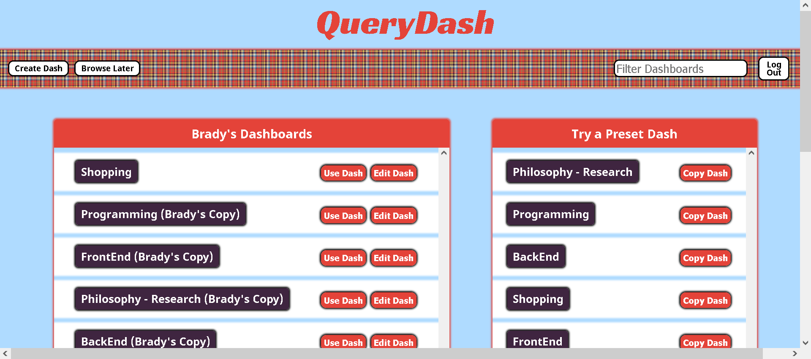

# [QueryDash](https://querydash.herokuapp.com/)

## [Demo Video](https://www.youtube.com/watch?v=GOQMPuTuUuw)

I created this application for my capstone project at Suncoast Developers Guild using Javascript, React Hooks, C#/.NET, Entity Framework Core, and [Gigablast's Web Search API](http://www.gigablast.com/api.html).

I had a great time working through the challenges associated with building this project. I built this application to address the research process that is common to all software engineers, but I realized that the use cases were more numerous as I developed the idea.

QueryDash is my attempt to create a lightweight, search aggregation application. The dashboards are the main feature. They contain panels that are associated with a particular website. The FrontEnd dashboard, for example, includes the MDN Web Docs, W3 Schools, and Stack Overflow, among others. The user enters their desired search in the navigation bar and presses Enter (or clicks search), and, in a few seconds, the panels populate with search results from separate refined search requests executed in parallel on QueryDash's back-end via Gigablast's Web Search API. The search queries are refined by the 'site:' parameter and the websites associated with the panels that belong to the dashboard being used.

Each search result includes a live link to the result, the head of the result, and a summary of the result. If you navigate away from the page, QueryDash sticks your last results by dashboard in local storage, so you can return to any dash after navigating away from QueryDash to a result and see the results from your last search. If you create an account, you can archive results, and QueryDash will save your opened results as well.

Dashboards can be created, copied, and deleted and panels can be added, created, and removed from dashboards (panels and dashboards have a many-to-many relationship). So, the user can research virtually any topic they want at almost any website they want (for example, there's a shopping dashboard, a front-end dashboard, and a back-end dashboard, among others), and they can change the websites they search at as they discover new resources.

This is a work in progress, so please don't abuse the search feature. You're welcome to try QueryDash and create an account, dashes, and panels, but the API requests really start to pile up when the search feature is used excessively. I'm planning a transition to an un-metered service sometime soon. Please reach out to me at brady.grapentine@gmail.com with QA comments, questions, or suggestions.
